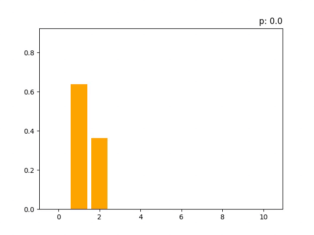
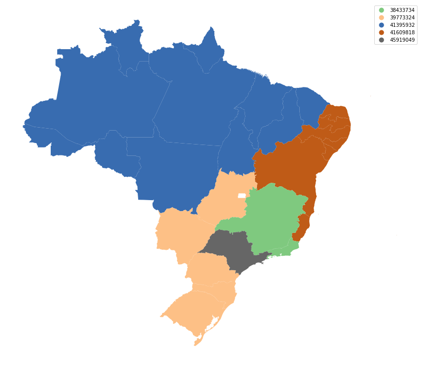
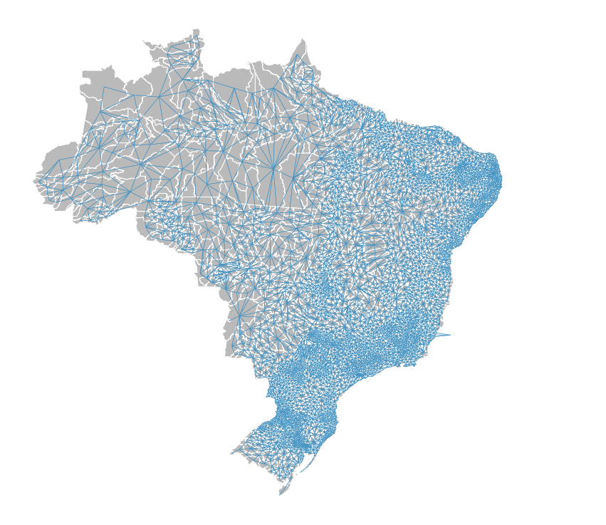
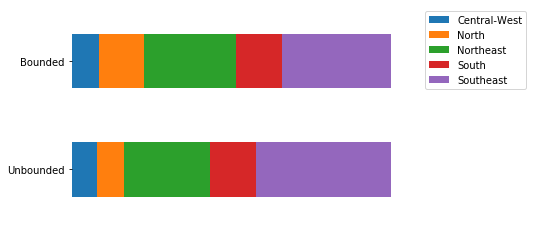

# Minor Projects

Collection of small projects related to Operations Research, Data Science and Statistics.

## 4. [Chromatic Number of Random Graphs](https://github.com/franciscogaluppo/Minor-Projects/blob/master/Chromatic%20Number%20of%20Random%20Graphs.ipynb)

Let a random graph G with parameters (n,p) be a graph with n vertices which every possible edge has probability p of being chosen. Here, we sample the distribution of the chromatic number of these random graphs.

## 3. [Brazilian Partitions](https://github.com/franciscogaluppo/Minor-Projects/blob/master/Brazilian%20Partition.ipynb)

Using Mixed Integer Programming to partite Brazil in different regions with similar population.

## 2. [Brazilian Graph](https://github.com/franciscogaluppo/Minor-Projects/blob/master/Brazilian%20graph.ipynb)

The main objective here is to use the brazilian map as an object for our MIP projects. In particular, we can study how a population from a municipality relates to the neighboring municipalities. So, firstly, we need the graph of the brazilian map.

## 1. [Congress](https://github.com/franciscogaluppo/Minor-Projects/blob/master/Congress.ipynb)

Each brazilian state has a number of seats in the House of Representatives proportional to its population. But there's a caveat: there is a minimum and a maximum of seats a single state can hold. We can use Mixed Integer Programming to compare the true proportional allocation of seats with the one used by the congress.